[](https://clojars.org/org.clojars.cartesiantheatrics/clj-manifold3d)


# clj-manifold3d

This library provides a Clojure(Script) wrapper over Emmett Lalish's incredible Manifold 3D geometry library. The CLJ implementation is based on JNI bindings to c++ produced via. javacpp: see https://github.com/SovereignShop/manifold. The CLJS implementation is based on emscripten build of Manifold for wasm.

It implements most of the library functionality, plus extends it to support polyhedrons and lofts. It provides nearly a full superset of OpenSCAD functionality.

Manifold represents a dramatic advance in the state-of-the-art of open-source programmatic CAD. It has been adopted by most major CAD kernels.


# Install

You need include the native [Manifold Bindings](https://github.com/SovereignShop/manifold) for your platform separately. For example:

``` clojure
;; Linux
{:deps {org.clojars.cartesiantheatrics/manifold3d$linux-x86_64 {:mvn/version "1.0.73"}}}
;; Mac
{:deps {org.clojars.cartesiantheatrics/manifold3d$mac-x86_64 {:mvn/version "1.0.73"}}}
;; See build artifacts for experimental Windows jars: https://github.com/SovereignShop/manifold/actions
```

The Manifold .so libs are included in the bindings jar. You'll also need to have libassimp installed on your system:

``` sh
;; Ubuntu
sudo apt install libassimp-dev
;; Mac
brew install pkg-config assimp
;; Windows
git clone https://github.com/assimp/assimp.git
cd assimp
git checkout v5.2.5
cmake CMakeLists.txt -DASSIMP_BUILD_ZLIB=ON -DCMAKE_BUILD_TYPE=Release
cmake --build . --config Release
cmake --install . --config Release
```

The ClojureScript lib is not yet well supported or available via. Maven. You'll have to clone the repo and move `public/manifold.wasm` into `public/js/`. Run `npm install` to install the gltf (for rendering meshes) then connect via. shadow. There's a half-baked function called `createGLTF` in `manifold_viewer.js` that will take a manifold and throw it onto the `model-viewer` element defined in the index.html.

# Documentation

See the core namespace for some documentation. Refer to the original library for more complete documentation. 

# Examples

Examples should look very familiar if you've ever used OpenSCAD.

## 2D hulls

``` clojure
(require '[clj-manifold3d.core 
           :refer [cube cylinder sphere cylinder extrude cross-section frame square circle
                   union difference intersection translate get-mesh export-mesh status rotate
                   hull revolve offset refine smooth loft scale material text scale-to-height
                   three-point-arc frame-2d transform slice tetrahedron slices polyhedron]])
                                       

(-> (hull (circle 5)
          (-> (square 10 10 true)
              (translate [30 0])))
    (extrude 80 70 180 [0.7 0.7])
    (get-mesh)
    (export-mesh "hull2D.stl"))
```

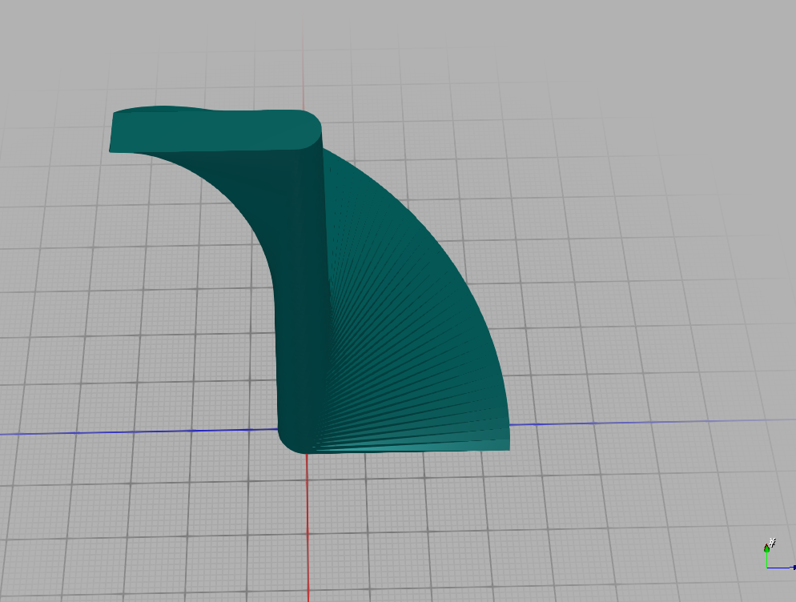

## 3D hulls

``` clojure
(-> (hull (cylinder 2 12 12 120)
          (-> (sphere 4 120)
              (translate [0 0 20])))
    (get-mesh)
    (export-mesh "hull3D.stl"))
```

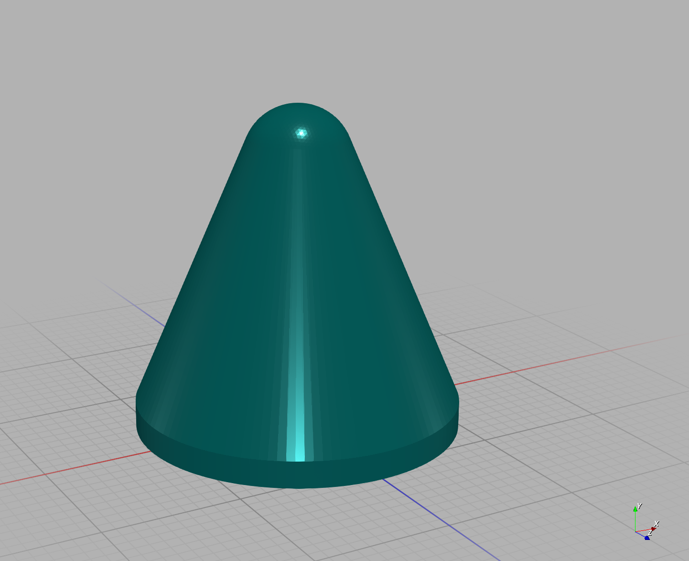

## Partial revolutions

``` clojure
(let [m (-> (cross-section [[-10 0] [10 0] [0 10]])
            (translate [30 0]))]
  (-> (difference m (offset m -1))
      (revolve 50 135)
      (get-mesh)
      (export-mesh "revolve.stl")))
```

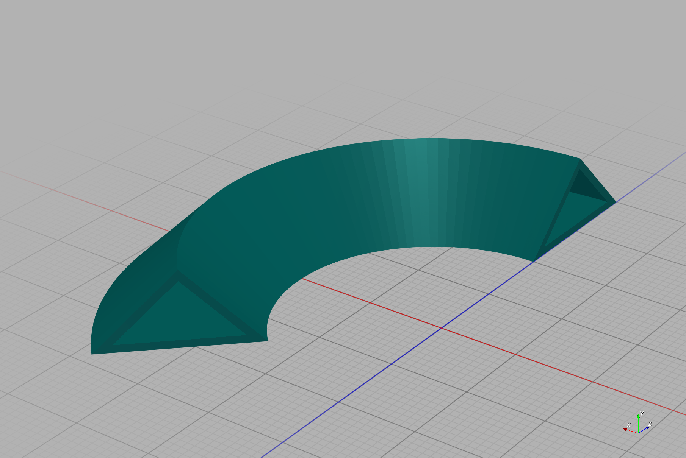

## Polyhedron

``` clojure
(-> (polyhedron [[0 0 0]
                 [5 0 0]
                 [5 5 0]
                 [0 5 0]
                 [0 0 5]
                 [5 0 5]
                 [5 5 5]
                 [0 5 5]]
                [[0 3 2 1]
                 [4 5 6 7]
                 [0 1 5 4]
                 [1 2 6 5]
                 [2 3 7 6]
                 [3 0 4 7]])
    (get-mesh)
    (export-mesh "polyhedron-cube.stl"))
```

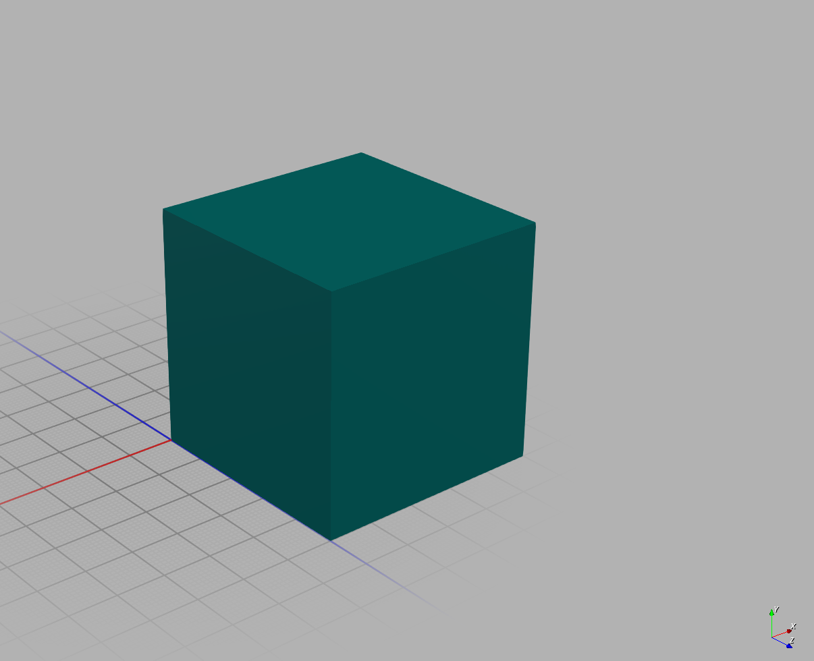


## Frames

Transform frames, which are 4x3 affine transformation matrices, can be manipulated similar to manifolds.


``` clojure
(mapv vec
      (-> (frame 1)
          (translate [0 0 10])
          (vec)))
;; => [[1.0 0.0 0.0] [0.0 1.0 0.0] [0.0 0.0 1.0] [0.0 0.0 10.0]]
```

Frames transform slightly differently than manifolds. The rotation components are best thought of as basis vectors of a coordinate frame, with the last component representing the position of that frame. Rotations and translations are applied relative to the frame, turtle-graphics style. Here is an example of applying a transform to a cylinder:


``` clojure
(-> (cylinder 50 5)
    (transform (-> (frame 1)
                   (rotate [0 (/ Math/PI 4) 0])
                   (translate [0 0 30]))))
```
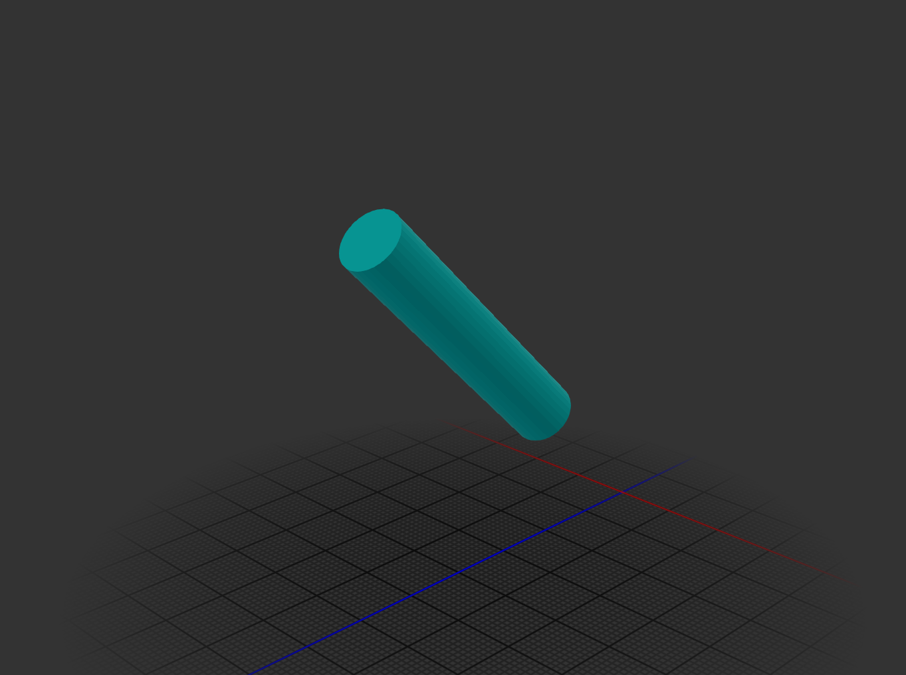


2D transform frames can also be manipulated similar to cross sections.

``` clojure
(mapv vec
      (-> (frame-2d 1)
          (translate [0 10])
          (vec)))
;; => [[1.0 0.0] [0.0 1.0] [0.0 0.0]]
```


## Loft

``` clojure
(-> (let [c (difference (square 10 10 true) (square 8 8 true))]
      (loft [c (scale c [1.5 1.5]) c]
            [(frame 1)
             (-> (frame 1) (translate [0 0 15]))
             (-> (frame 1) (translate [0 0 30]))]))
    (get-mesh)
    (export-mesh "loft.stl"))
```

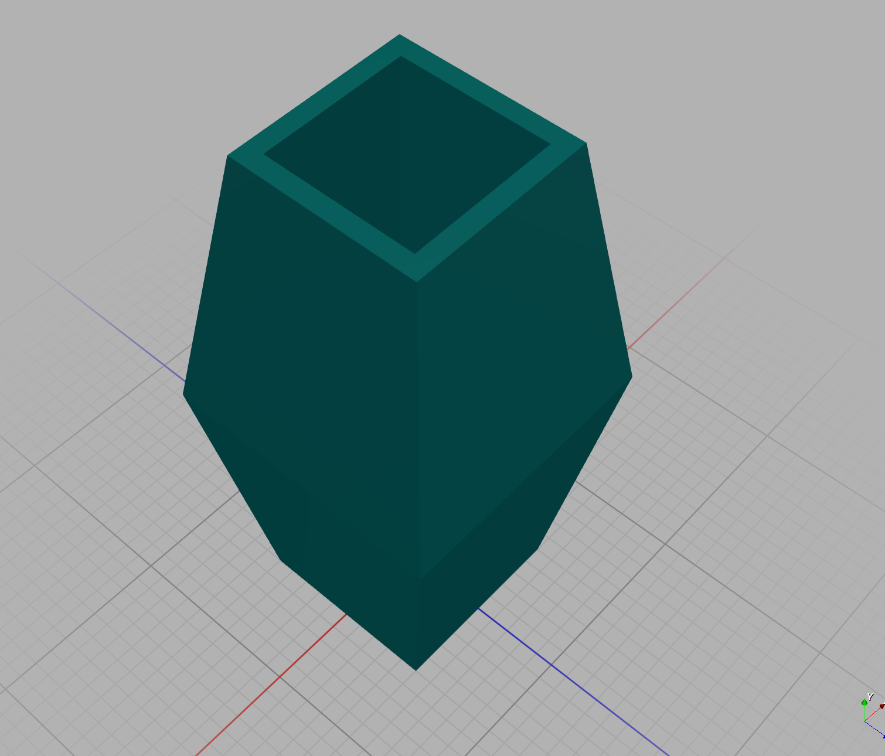

Loft and also handle one-to-many and many-to-one vertex mappings:

``` clojure
(-> (loft [(circle 20 15)
           (square 30 30 true)
           (circle 20 20)]
          [(frame 1)
           (-> (frame 1) (translate [0 0 15]))
           (-> (frame 1) (translate [0 0 30]))])
    (get-mesh)
    (export-mesh "monomorphic-loft.stl"))
```

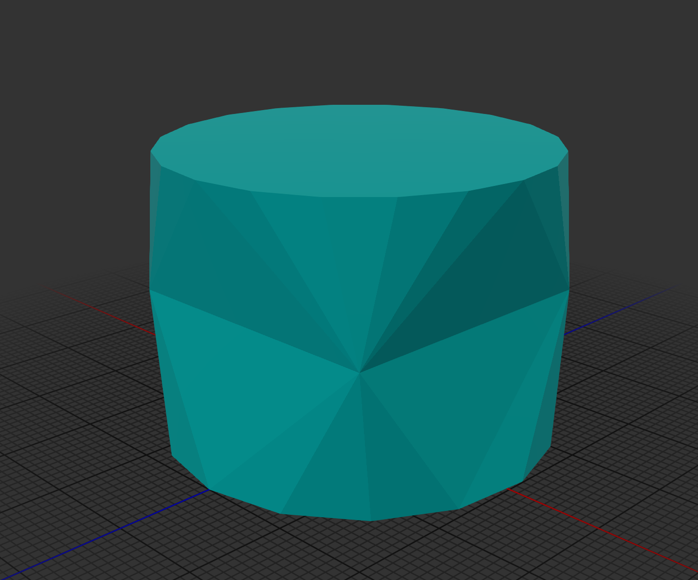


There is also a single arity version of loft:

``` clojure
(-> (loft [{:cross-section (circle 50 12)
            :frame (frame 1)}
           {:frame (-> (frame 1) (translate [0 0 20]))}
           {:frame (-> (frame 1) (translate [0 0 20]))
            :cross-section (circle 46 12)}
           {:frame (-> (frame 1) (translate [0 0 3]))}])
    (get-mesh)
    (export-mesh "single-arity-loft.stl"))
```


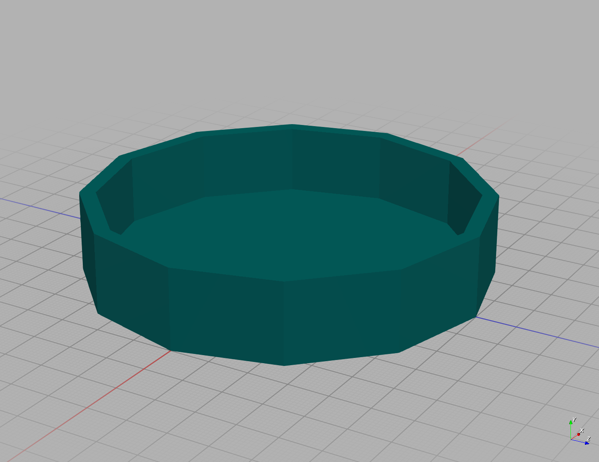

## Text

``` clojure
(-> (text "resources/fonts/Cinzel-Regular.ttf" "Manifold" 10 20 :non-zero)
    (scale-to-height 100)
    (extrude 20)
    (get-mesh)
    (export-mesh "text.glb" :material mesh-material))
```
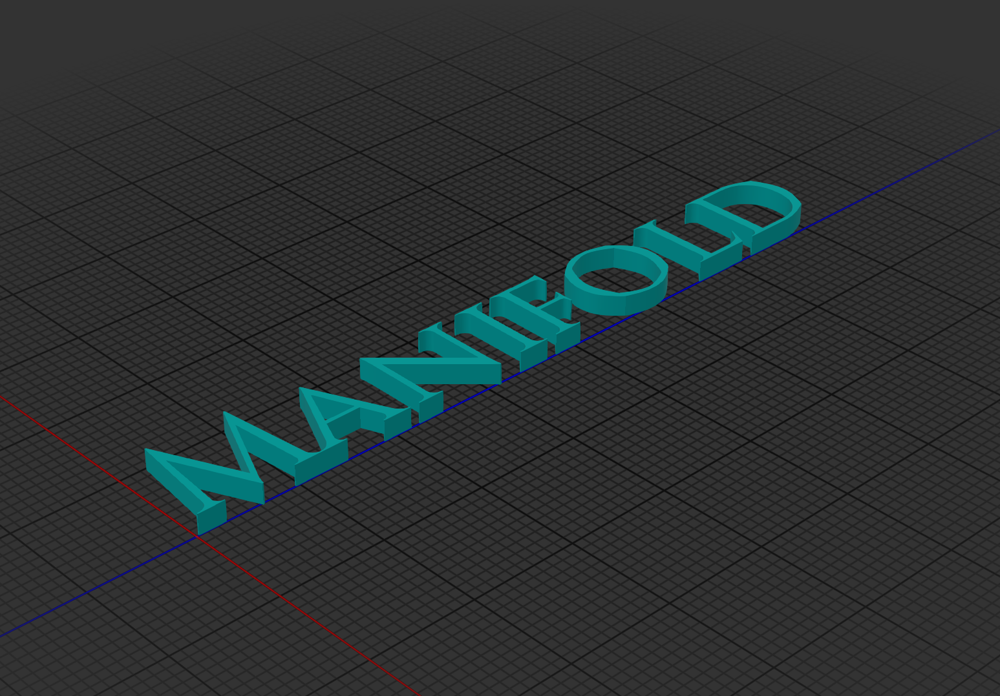

## Slice 

Slice solves for the cross-section of a manifold that intersects the x/y plane.

``` clojure
(-> (slice (scale (tetrahedron) [5 10 15]))
    (extrude 1/2)
    (get-mesh)
    (export-mesh "slice.glb" :material mesh-material))
```

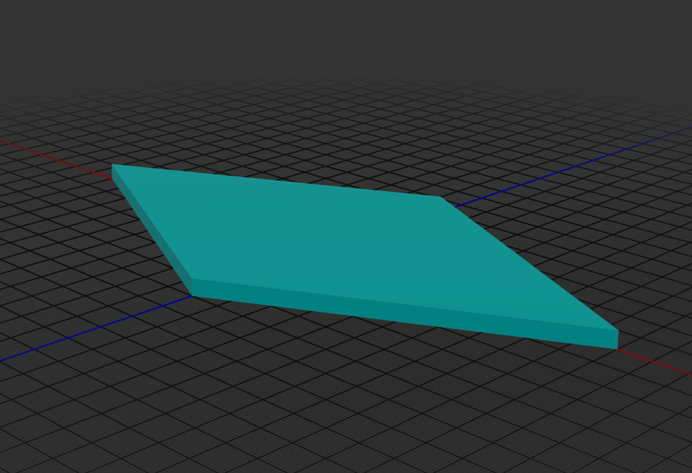

There is an efficient aglorithm that solves for N equally spaces slices.

``` clojure
(-> (union
     (for [[i slice] (map-indexed vector (slices (scale (tetrahedron) [5 10 15]) 5 10 10) )]
       (-> slice
           (extrude 1/8)
           (translate [0 0 (* i 0.5)]))))
    (get-mesh)
    (export-mesh "slices.glb" :material mesh-material))

```

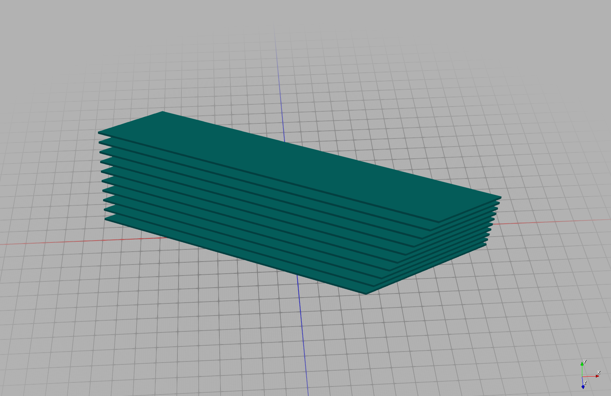

## Surface 

Surface creates a manifold from a heatmap structure:

``` clojure
(defn sinewave-heatmap
  "Generates a 3D sinewave heatmap.
  The output is a vector of vectors representing a square matrix.
  Each cell represents the height at that x/y coordinate based on a sinewave.

  Args:
  - size: The size of the matrix (width and height).
  - frequency: Frequency of the sinewave (controls the number of wave oscillations).
  - amplitude: Amplitude of the sinewave (controls the height of the wave).
  - phase: Phase shift of the sinewave.

  Returns a matrix where each value is the sinewave height at that coordinate."
  [size frequency amplitude phase]
  (vec
   (for [y (range size)]
     (vec
      (for [x (range size)]
        (+ (+ 10 amplitude)
           (* amplitude
              (Math/sin
               (+ (* frequency (/ x size))
                  (* frequency (/ y size))
                  phase))))))))) 

(-> (sinewave-heatmap 50 10 5 0)
    (surface 1.0)
    (get-mesh)
    (export-mesh "sine-wave-surface.glb" :material mesh-material))
```

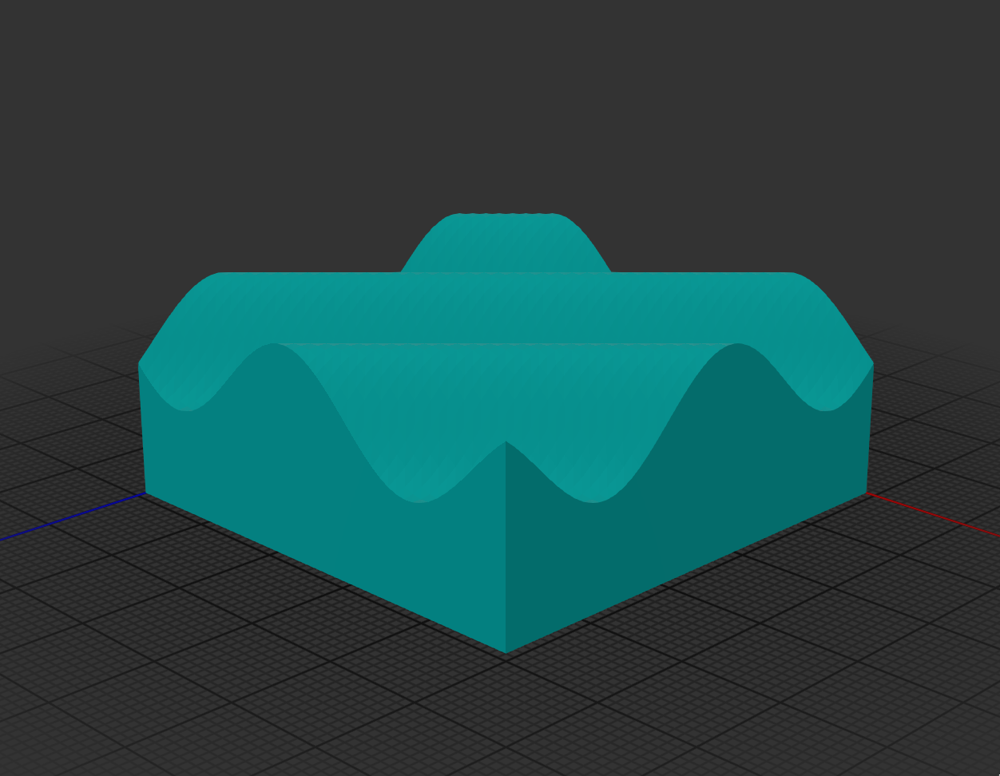

Use the underlying `MeshUtils/CreateSurface` for max performance when generating large heatmaps. You can also use create a surface from a `.png`, `.jpg` or other image file using `load-surface`.

# Example Projects

A Simple rapidly printable hydroponic tower:
https://github.com/SovereignShop/spiralized-hydroponic-tower

Kossel delta printer:
https://github.com/SovereignShop/kossel-printer/
