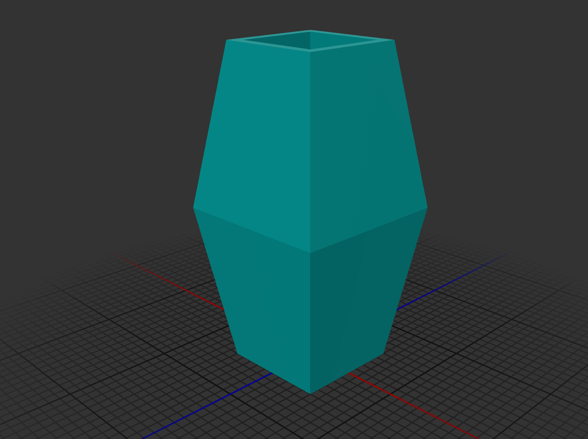
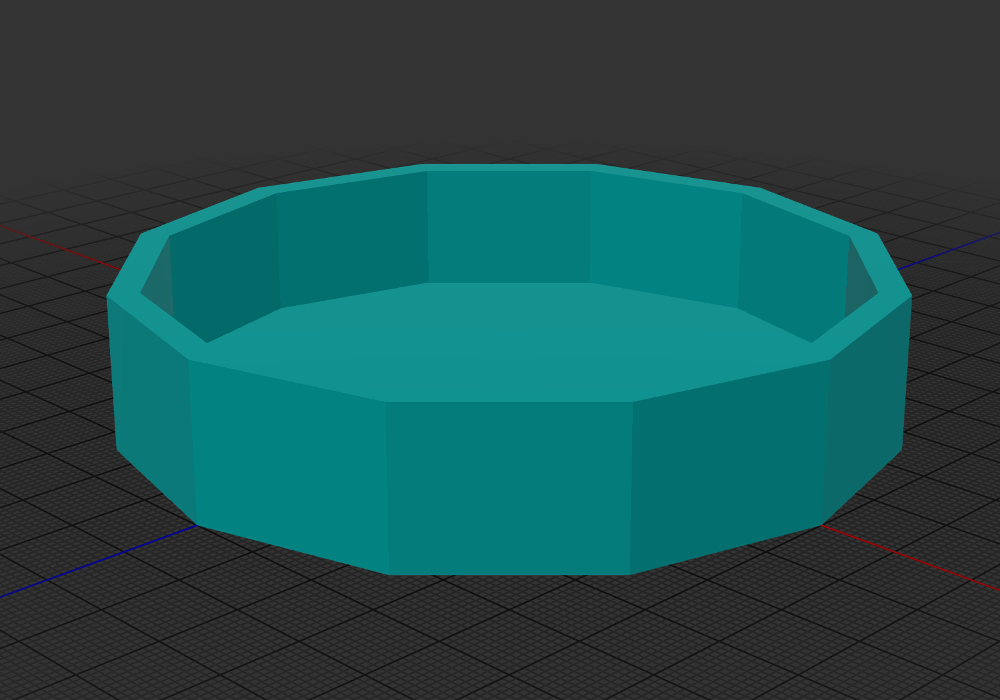
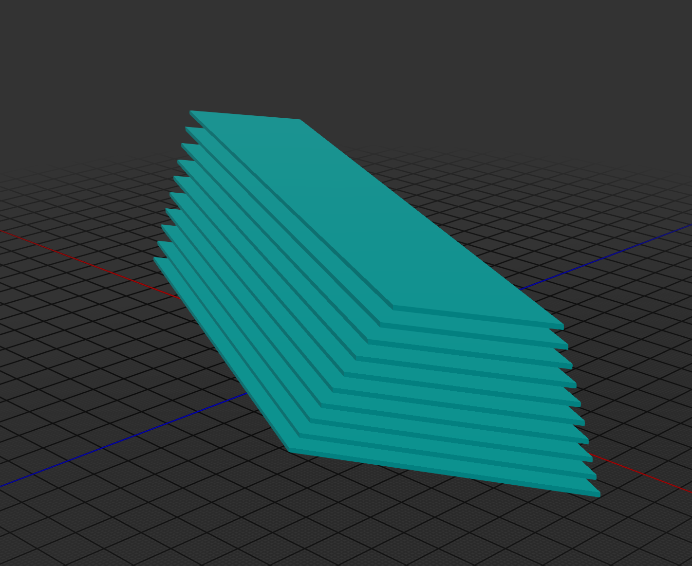
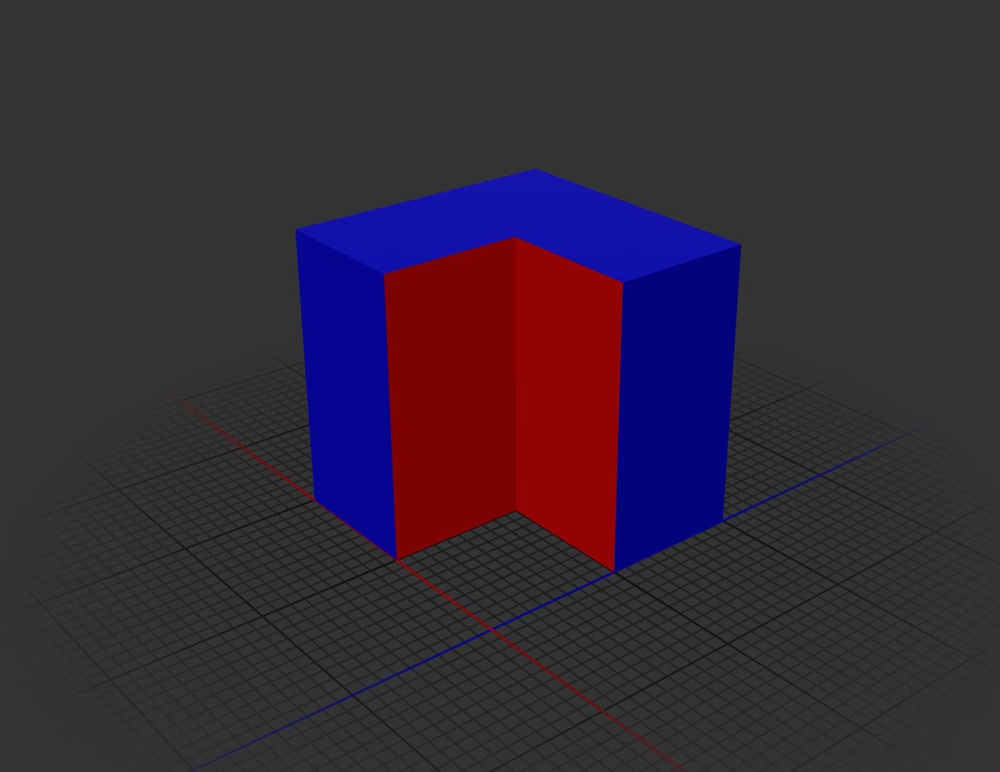
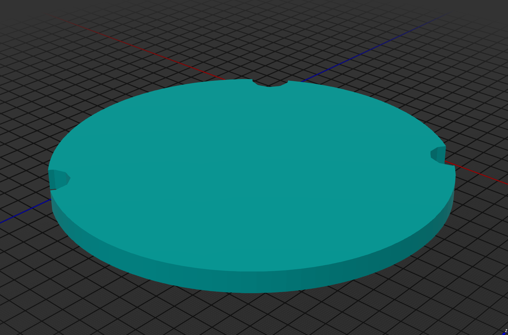

[](https://clojars.org/org.clojars.cartesiantheatrics/clj-manifold3d)


# clj-manifold3d

This library provides a Clojure(Script) wrapper over Emmett Lalish's incredible Manifold 3D geometry library. The CLJ implementation is based on JNI bindings to c++ produced via. javacpp: see https://github.com/SovereignShop/manifold. The CLJS implementation is based on emscripten build of Manifold for wasm.

It implements most of the library functionality, plus extends it to support polyhedrons and lofts. It provides nearly a full superset of OpenSCAD functionality.

Manifold represents a dramatic advance in the state-of-the-art of open-source programmatic CAD. It has been adopted by most major CAD kernels.


# Install

You need include the native [Manifold Bindings](https://github.com/SovereignShop/manifold) for your platform separately. For example:

``` clojure
;; Linux
{:deps {org.clojars.cartesiantheatrics/manifold3d$linux-x86_64 {:mvn/version "1.0.73"}}}
;; Mac
{:deps {org.clojars.cartesiantheatrics/manifold3d$mac-x86_64 {:mvn/version "1.0.73"}}}
;; See build artifacts for experimental Windows jars: https://github.com/SovereignShop/manifold/actions
```

The Manifold .so libs are included in the bindings jar. You'll also need to have libassimp installed on your system:

``` sh
;; Ubuntu
sudo apt install libassimp-dev
;; Mac
brew install pkg-config assimp
;; Windows
git clone https://github.com/assimp/assimp.git
cd assimp
git checkout v5.2.5
cmake CMakeLists.txt -DASSIMP_BUILD_ZLIB=ON -DCMAKE_BUILD_TYPE=Release
cmake --build . --config Release
cmake --install . --config Release
```

The ClojureScript lib is not yet well supported or available via. Maven. You'll have to clone the repo and move `public/manifold.wasm` into `public/js/`. Run `npm install` to install the gltf (for rendering meshes) then connect via. shadow. There's a half-baked function called `createGLTF` in `manifold_viewer.js` that will take a manifold and throw it onto the `model-viewer` element defined in the index.html.

# Examples

Examples should look familiar if you've ever used OpenSCAD.

## Manifolds

Manifolds are the core datatype representing a 3D object. They are water-tight meshes comprised of triangular faces. They are guaranteed closed under the fundamental CSG operations: `union`, `difference`, and `intersection`.

``` clojure
(let [cube (m/cube 20 20 20 true)
      sphere (m/sphere 12 30)]
  (-> (m/union
       (-> (m/union cube sphere)
           (m/translate [30 0 0]))
       (-> (m/difference cube sphere)
           (m/translate [-30 0 0]))
       (m/intersection cube sphere))
      (m/get-mesh)
      (m/export-mesh "manifolds.glb" :material mesh-material)))
```


## Cross Sections

Cross Sections represent 2D shapes. There are basic cross section constructors like `square` and `circle`, or they can be constructed from one or multiple polygons (vertex sequences).

``` clojure
(-> (m/cross-section (cons [0 0]
                           (for [i (range 18)]
                             [(* 20 (Math/cos (* i (/ (* 2 Math/PI) 19))))
                              (* 20 (Math/sin (* i (/ (* 2 Math/PI) 19))))])))
    (m/extrude 1)
    (m/get-mesh)
    (m/export-mesh "cross-section.glb" :material mesh-material))
```


Cross Sections are (roughly) isomorphic to a set of polygons for which vertex order determines whether a polygon encodes a hole.

``` clojure
(-> (m/cross-section [(for [i (range 20)]
                        [(* 20 (Math/cos (* i (/ (* 2 Math/PI) 19))))
                         (* 20 (Math/sin (* i (/ (* 2 Math/PI) 19))))])
                      (reverse
                       (for [i (range 20)]
                         [(* 18 (Math/cos (* i (/ (* 2 Math/PI) 19))))
                          (* 18 (Math/sin (* i (/ (* 2 Math/PI) 19))))]))])
    (m/extrude 1)
    (m/get-mesh)
    (m/export-mesh "cross-section-with-hole.glb" :material mesh-material))
```


## Revolve

``` clojure
(let [m (-> (m/cross-section [[-10 0] [10 0] [0 10]])
            (m/translate [30 0]))]
  (-> (m/difference m (m/offset m -1))
      (m/revolve 50 135)
      (m/get-mesh)
      (m/export-mesh "revolve.glb" :material mesh-material)))
```


## 2D hulls

``` clojure
(require '[clj-manifold3d.core :as m])
                                       
(def mesh-material (m/material :roughness 0.0 :metalness 0.0 :color [0.0 0.7 0.7 1]))
                                       
(-> (m/hull
     (m/circle 5)
     (-> (m/square 10 10 true)
         (m/translate [30 0])))
    (m/extrude 80 70 180 [0.7 0.7])
    (m/get-mesh)
    (m/export-mesh "hull2D.glb" :material mesh-material))
```


## 3D hulls

``` clojure
(-> (m/hull (m/cylinder 2 12 12 120)
            (-> (m/sphere 4 120)
                (m/translate [0 0 20])))
    (m/get-mesh)
    (m/export-mesh "hull3D.glb"))
```


## Polyhedron

``` clojure
(-> (m/polyhedron [[0 0 0]
                   [5 0 0]
                   [5 5 0]
                   [0 5 0]
                   [0 0 5]
                   [5 0 5]
                   [5 5 5]
                   [0 5 5]]
                  [[0 3 2 1]
                   [4 5 6 7]
                   [0 1 5 4]
                   [1 2 6 5]
                   [2 3 7 6]
                   [3 0 4 7]])
    (m/get-mesh)
    (m/export-mesh "polyhedron-cube.glb" :material mesh-material))
```


## Frames

Transform frames, which are 3x4 affine transformation matrices, can be manipulated similar to manifolds.


``` clojure
(mapv vec
      (-> (frame 1)
          (translate [0 0 10])
          (vec)))
;; => [[1.0 0.0 0.0] [0.0 1.0 0.0] [0.0 0.0 1.0] [0.0 0.0 10.0]]
```

Frames transform slightly differently than manifolds. The rotation components are best thought of as basis vectors of a coordinate frame, with the last component representing the position of that frame. Rotations and translations are applied relative to the frame, turtle-graphics style. Here is an example of applying a transform to a cylinder:


``` clojure
(-> (m/cylinder 50 5)
    (m/transform (-> (m/frame 1)
                     (m/rotate [0 (/ Math/PI 4) 0])
                     (m/translate [0 0 30])))
    (m/get-mesh)
    (m/export-mesh "transform.glb" :material mesh-material)) 
```


2D transform frames can also be manipulated similar to cross sections.

``` clojure
(mapv vec
      (-> (m/frame-2d 1)
          (m/translate [0 10])
          (vec)))
;; => [[1.0 0.0] [0.0 1.0] [0.0 0.0]]
```


## Loft

Loft connects a series of cross sections positioned in 3D space to form a manifold. Edges are constructed between vertices of adjacent cross sections.

``` clojure
(-> (let [c (m/difference (m/square 10 10 true) (m/square 8 8 true))]
      (m/loft [c (m/scale c [1.5 1.5]) c]
              [(m/frame 1)
               (m/translate (m/frame) [0 0 15])
               (m/translate (m/frame) [0 0 30])]))
    (m/get-mesh)
    (m/export-mesh "loft.glb" :material mesh-material))
```



Loft and also handle one-to-many and many-to-one vertex mappings.

``` clojure
(-> (m/loft [(m/circle 20 15)
             (m/square 30 30 true)
             (m/circle 20 20)]
            [(m/frame 1)
             (m/translate (m/frame) [0 0 15])
             (m/translate (m/frame) [0 0 30])])
    (m/get-mesh)
    (m/export-mesh "monomorphic-loft.glb" :material mesh-material))
```


There is also a single arity version of loft.

``` clojure
(-> (m/loft [{:cross-section (m/circle 50 12)
              :frame (m/frame)}
             {:frame (m/translate (m/frame) [0 0 20])}
             {:cross-section (m/circle 46 12)}
             {:frame (m/translate (m/frame) [0 0 3])}])
    (m/get-mesh)
    (m/export-mesh "single-arity-loft.glb" :material mesh-material))
```




## Text

``` clojure
(-> (m/text "resources/fonts/Cinzel-Regular.ttf" "Manifold" 10 20 :non-zero)
    (m/scale-to-height 100)
    (m/extrude 20)
    (m/get-mesh)
    (m/export-mesh "text.glb" :material mesh-material))
```


## Slice 

Slice solves for the cross-section of a manifold that intersects the x/y plane.

``` clojure
(-> (m/slice (m/scale (m/tetrahedron) [5 10 15]))
    (m/extrude 1/2)
    (m/get-mesh)
    (m/export-mesh "slice.glb" :material mesh-material))
```


There is an efficient aglorithm that solves for N equally spaces slices.

``` clojure
(-> (m/union
     (for [[i slice] (map-indexed vector (m/slices (m/scale (m/tetrahedron) [5 10 15]) 5 10 10) )]
       (-> slice
           (m/extrude 1/8)
           (m/translate [0 0 (* i 0.5)]))))
    (m/get-mesh)
    (m/export-mesh "slices.glb" :material mesh-material))
```



## Surface 

Surface creates a manifold from a heatmap structure.

``` clojure
(defn sinewave-heatmap
  "Generates a 3D sinewave heatmap.
  The output is a vector of vectors representing a square matrix.
  Each cell represents the height at that x/y coordinate based on a sinewave.

  Args:
  - size: The size of the matrix (width and height).
  - frequency: Frequency of the sinewave (controls the number of wave oscillations).
  - amplitude: Amplitude of the sinewave (controls the height of the wave).
  - phase: Phase shift of the sinewave.

  Returns a matrix where each value is the sinewave height at that coordinate."
  [size frequency amplitude phase]
  (vec
   (for [y (range size)]
     (vec
      (for [x (range size)]
        (+ (+ 10 amplitude)
           (* amplitude
              (Math/sin
               (+ (* frequency (/ x size))
                  (* frequency (/ y size))
                  phase)))))))))

(-> (sinewave-heatmap 50 10 5 0)
    (m/surface 1.0)
    (m/get-mesh)
    (m/export-mesh "sine-wave-surface.glb" :material mesh-material))
```


Use the underlying `MeshUtils/CreateSurface` for max performance when generating large heatmaps. You can also use create a surface from a `.png`, `.jpg` or other image file using `load-surface`.

There is also a primitive algorithm to parse a .ply point cloud to a surface mesh, useful primarily for geo-mapping applications. Here's an example from a ~8GB point cloud:


## Color

In addition to specifying a uniform color when exporting a manifold, color attributes can be added to a manifold's vertex properties. This ensures vertex colors preserved under boolean operations.

``` clojure
(->
 (m/difference
  (m/color (m/cube 20 20 20) [0 0 1 1])
  (m/color (m/cube 20 20 40 true) [1 0 0 1]))
 (m/get-mesh-gl)
 (m/export-mesh "colored-manifold.glb"
                :material (m/material :roughness 0.0 :metalness 0.0 :color-idx 0)))
```



## Compose

`compose` combines manifolds or cross sections together without performing any CSG operations on them. 

``` clojure
(-> (m/compose
     (m/color (m/cube 30 30 30 true)
              [1 1 1 0.5])
     (m/color (m/sphere 12 40)
              [0 0 1 1.0]))
    (m/get-mesh)
    (m/export-mesh "compose.glb"
                   :material (m/material :roughness 0.0 :metalness 0.0 :color-idx 0 :alpha-idx 3)))
```


## Three Point Circles & Arcs

Define a circle by providing three points that its perimeter intersects.

``` clojure
(let [p1 [0 0] p2 [1 12] p3 [15 0]]
  (-> (m/difference
       (m/circle p1 p2 p3 100)
       (m/union
        (for [p [p1 p2 p3]]
          (-> (m/circle 1 10)
              (m/translate p)))))
      (m/extrude 1)
      (m/get-mesh)
      (m/export-mesh "three-point-circle.glb" :material mesh-material)))
```



Likewise for partial circles/arcs.

``` clojure
(let [p1 [0 0] p2 [2 5] p3 [-6 10]]
  (-> (m/union
       (m/three-point-arc p1 p2 p3 20)
       (m/union
        (for [p [p1 p2 p3]]
          (-> (m/circle 1 10)
              (m/translate p)))))
      (m/extrude 1)
      (m/get-mesh)
      (m/export-mesh "three-point-arc.glb" :material mesh-material)))
```


Use `three-point-arc-points` to get a vector of the points corresponding to the arc segment.

## Get Vertices 

Get the vertices of a Manifold using `get-vertices`:

``` clojure
(-> (let [verts (m/get-vertices (m/cube 20 20 20 true))]
      (m/union
       (for [vert verts]
         (-> (m/sphere 2 20)
             (m/translate vert)))))
    (m/get-mesh)
    (m/export-mesh "get-vertices.glb" :material mesh-material))
```


## Get Halfedges

You can get the Halfedges of a Manifold using `get-halfgedges`:

```clojure
(-> (let [m (m/cube 40 40 40 true)
          verts (m/get-vertices m)
          halfedges (m/get-halfedges m)]
      (m/compose
       (cons (m/color m [0 1 0 0.4])
             (for [halfedge halfedges]
               (let [v1 (nth verts (:start-vert halfedge))
                     v2 (nth verts (:end-vert halfedge))
                     m (m/hull
                        (m/translate (m/sphere 1 15) v1)
                        (m/translate (m/sphere 3 15) v2))]
                 (if (m/is-forward halfedge)
                   (m/color m [1 0 0 0.6])
                   (m/color m [0 0 1 0.6])))))))
    (m/get-mesh)
    (m/export-mesh "get-halfedges.glb" :material (m/material :roughness 0.0
                                                             :metalness 0.0
                                                             :color-idx 0
                                                             :alpha-idx 3)))
```


The halfedge array is a useful data-structure that can be used to "walk" over adjacent faces of manifolds.


## Get Triangles


``` clojure
(m/get-triangles )
```

# Example Projects

A Simple rapidly printable hydroponic tower:
https://github.com/SovereignShop/spiralized-hydroponic-tower

Kossel delta printer:
https://github.com/SovereignShop/kossel-printer/
