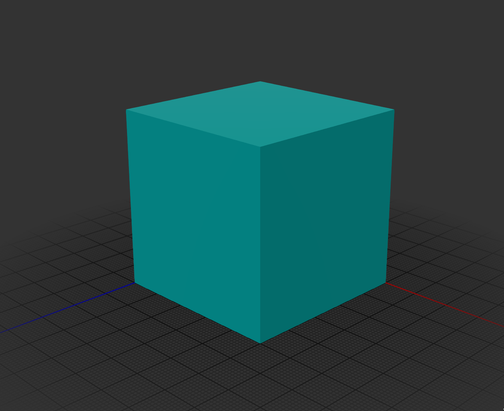

[](https://clojars.org/org.clojars.cartesiantheatrics/clj-manifold3d)


# clj-manifold3d

This library provides a Clojure(Script) wrapper over Emmett Lalish's incredible Manifold 3D geometry library. The CLJ implementation is based on JNI bindings to c++ produced via. javacpp: see https://github.com/SovereignShop/manifold. The CLJS implementation is based on emscripten build of Manifold for wasm.

It implements most of the library functionality, plus extends it to support polyhedrons and lofts. It provides nearly a full superset of OpenSCAD functionality (except no text support yet).

Manifold represents a dramatic advance in the state-of-the-art of open-source programmatic CAD. It has been adopted by most major CAD kernels.


# Install

You need include the native [Manifold Bindings](https://github.com/SovereignShop/manifold) for your platform separately. For example:

``` clojure
;; Linux
{:deps {org.clojars.cartesiantheatrics/manifold3d$linux-x86_64 {:mvn/version "1.0.73"}}}
;; Mac
{:deps {org.clojars.cartesiantheatrics/manifold3d$mac-x86_64 {:mvn/version "1.0.73"}}}
;; See build artifacts for experimental Windows jars: https://github.com/SovereignShop/manifold/actions
```

The Manifold .so libs are included in the bindings jar. You'll also need to have libassimp installed on your system:

``` sh
;; Ubuntu
sudo apt install libassimp-dev
;; Mac
brew install pkg-config assimp
;; Windows
git clone https://github.com/assimp/assimp.git
cd assimp
git checkout v5.2.5
cmake CMakeLists.txt -DASSIMP_BUILD_ZLIB=ON -DCMAKE_BUILD_TYPE=Release
cmake --build . --config Release
cmake --install . --config Release
```

The ClojureScript lib is not yet well supported or available via. Maven. You'll have to clone the repo and move `public/manifold.wasm` into `public/js/`. Run `npm install` to install the gltf (for rendering meshes) then connect via. shadow. There's a half-baked function called `createGLTF` in `manifold_viewer.js` that will take a manifold and throw it onto the `model-viewer` element defined in the index.html.

# Documentation

See the core namespace for some documentation. Refer to the original library for more complete documentation. 

# Examples

Examples should look very familiar if you've ever used OpenSCAD.

2D hulls:

``` clojure
(require '[clj-manifold3d.core :refer [circle square translate extrude get-mesh export-mesh hull
                                       cross-section revolve difference cylinder sphere offset
                                       polyhedron loft frame]])

(-> (hull (circle 5)
          (-> (square 10 10 true)
              (translate [30 0])))
    (extrude 80 70 180 [0.7 0.7])
    (get-mesh)
    (export-mesh "hull2D.stl"))
```


3D hulls:

``` clojure
(-> (hull (cylinder 2 12 12 120)
          (-> (sphere 4 120)
              (translate [0 0 20])))
    (get-mesh)
    (export-mesh "hull3D.stl"))
```


Partial revolutions:

``` clojure
(let [m (-> (cross-section [[-10 0] [10 0] [0 10]])
            (translate [30 0]))]
  (-> (difference m (offset m -1))
      (revolve 50 135)
      (get-mesh)
      (export-mesh "revolve.stl")))
```


Polyhedron:

``` clojure
(-> (polyhedron [[0 0 0]
                 [5 0 0]
                 [5 5 0]
                 [0 5 0]
                 [0 0 5]
                 [5 0 5]
                 [5 5 5]
                 [0 5 5]]
                [[0 3 2 1]
                 [4 5 6 7]
                 [0 1 5 4]
                 [1 2 6 5]
                 [2 3 7 6]
                 [3 0 4 7]])
    (get-mesh)
    (export-mesh "polyhedron-cube.stl"))
```



Loft:

``` clojure
(-> (let [c (difference (square 10 10 true) (square 8 8 true))]
      (loft [c (scale c [1.5 1.5]) c]
            [(frame 1)
             (-> (frame 1) (translate [0 0 15]))
             (-> (frame 1) (translate [0 0 30]))]))
    (get-mesh)
    (export-mesh "loft.stl"))
```


# Example Projects

A Simple rapidly printable hydroponic tower:
https://github.com/SovereignShop/spiralized-hydroponic-tower

Kossel delta printer:
https://github.com/SovereignShop/kossel-printer/


