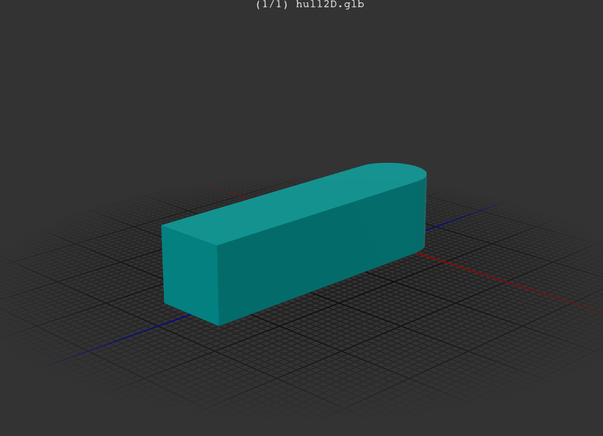

[](https://clojars.org/org.clojars.cartesiantheatrics/clj-manifold3d)


# clj-manifold3d

This library provides a Clojure(Script) wrapper over Emmett Lalish's incredible Manifold 3D geometry library. The CLJ implementation is based on JNI bindings to c++ produced via. javacpp: see https://github.com/SovereignShop/manifold. The CLJS implementation is based on emscripten build of Manifold for wasm. 

It currently only includes Linux builds of Manifold. I intend to support other environments soon.

It implements most of the library functionality, plus extends it to support native convex hulls (2D and 3D), partial
revolutions, and polyhedrons. It provides a full superset of OpenSCAD functionality, making migration as easy as possible.

Manifold represents a dramatic advance in the state-of-the-art of open-source programmatic CAD. It has been adopted by most major CAD kernels.

The library aspires to achieve code compatibility between Clojure and ClojureScript so that models
build in the more friendly Java environment can be shared and distributed in the javascript
environment. However, there are challenges in the way the Manifold js library is provided
as a promise. To (mostly) support this, this library elects to accept promises at the API level.
Working with promises can be pretty annoying, especially without a type system that supports
them well. For this reason, the CLJS API generally also works on non-promise objects.

# Status

Alpha, core API is unlikely to change much but test coverage is not complete. There likely are bugs. The CLJS implementation especially is likely to change.

# Documentation

See the core namespace for some documentation. Refer to the original library for more complete documentation. 

# Examples

Examples should look very familiar if you've ever used OpenSCAD. Bellow are demonstrations of some of the operations that are currently available in Manifold.

2D hulls:

``` clojure
(-> (hull (circle 5)
          (-> (square 10 10 true)
              (translate [30 0])))
    (extrude 80 70 180 [0.7 0.7])
    (get-mesh)
    (export-mesh "resources/models/hull2D.stl"))
```



3D hulls:

``` clojure
(-> (hull (cylinder 2 12 12 120)
          (-> (sphere 4 120)
              (translate [0 0 20])))
    (get-mesh)
    (export-mesh "resources/models/hull3D.stl"))
```


Partial revolutions:

``` clojure
(let [m (-> (cross-section [[-10 0] [10 0] [0 10]])
            (translate [30 0]))]
  (-> (difference m (offset m -1))
      (revolve 50 135)
      (get-mesh)
      (export-mesh "resources/models/revolve.stl")))
```


